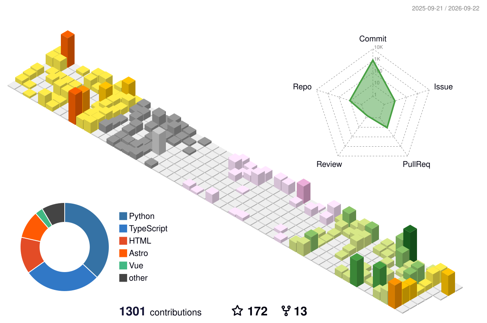

## Franka
  

*   来自湖北，南漂中
*   数据科学与大数据技术专业
*   广州大学大三在读
*   正在寻找前后端开发/数据分析相关实习，欢迎联系

=====================

*  **博客**  https://zhongye1.github.io/Arknight-notes/
  
*  **B站**   https://space.bilibili.com/446805121

* **Email**  zhongye@e.gzhu.edu.cn
  
*  **QQ**  2760913192

     

---

### 加入信工组，参与我们的校园信息化项目与学生技术社区建设！

https://github.com/Guangzhou-University-SITE-193
/ Open Source Organization from Guangzhou-University

---

